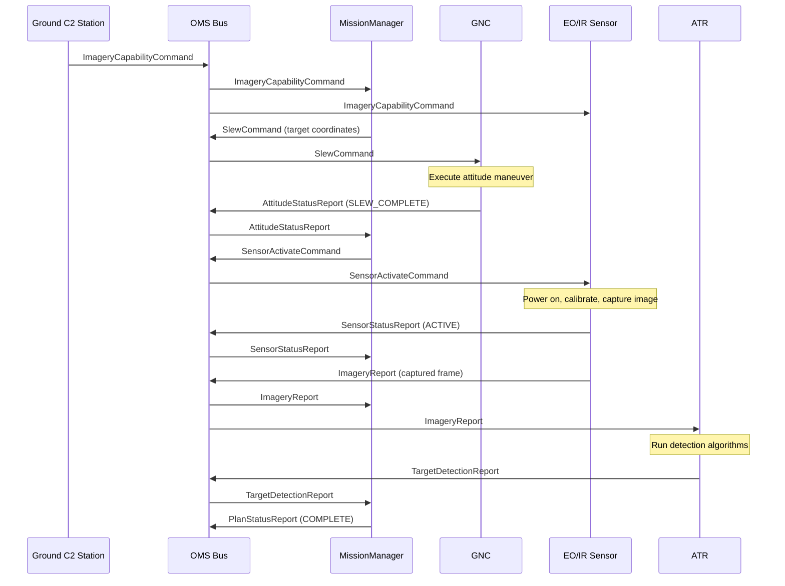

# Architecture Guide

## OMS Bus Architecture

SatSim implements an Open Mission Systems (OMS) bus architecture where spacecraft services communicate exclusively through UCI (Unified C2 Interface) XML messages. The central component is the `OMSBus`, a singleton message broker that maintains a subscription registry mapping message types to services. Services never reference each other directly -- all interaction is mediated by the bus, producing a fully decoupled publish-subscribe topology.

The bus performs three functions:

1. **Service registration** -- Each service is assigned a unique ID and receives a MiddleWare Adapter (MWA) handle upon registration.
2. **Subscription management** -- Services subscribe to specific UCI message types through their MWA. The bus maintains a `message_type -> set(service_id)` mapping.
3. **Message routing** -- When a message is published, the bus looks up all subscribers for that message type and delivers the validated XML payload to each subscriber's MWA, excluding the sender.

The bus also maintains an in-memory message log (with optional file-backed persistence) that records every routed message with its type, sender, timestamp, and destination list. This log supports debugging, replay, and post-scenario analysis.

## MiddleWare Adapter (MWA) Pattern

Every service on the bus is wrapped in a `MiddleWareAdapter` that acts as a gateway between the service logic and the OMS bus. The MWA handles:

- **Outbound validation** -- Serializes the service's message to UCI XML and validates it against the XSD schema before publishing. Invalid messages are rejected and a `FaultReport` is generated.
- **Inbound validation** -- Validates incoming XML before passing the deserialized message to the service's `handle_message()` method.
- **Subscription management** -- Provides a `subscribe(message_class)` method that registers interest in a message type with the bus.

### Code Example

```python
from satsim.bus.middleware import BaseService, OMSBus
from satsim.uci.messages import (
    Header, UCIMessage, SlewCommand, AttitudeStatusReport,
    StatusRequest, PowerModeCommand, FaultReport, HeartbeatMessage,
)

class GNCService(BaseService):
    """Guidance, Navigation & Control service."""

    def __init__(self, service_id="GNC_01", env=None):
        super().__init__(service_id, env)

    def start(self):
        super().start()
        # Subscribe to message types via MWA
        if self.mwa:
            self.mwa.subscribe(SlewCommand)
            self.mwa.subscribe(StatusRequest)
            self.mwa.subscribe(PowerModeCommand)
            self.mwa.subscribe(FaultReport)

    def handle_message(self, message: UCIMessage):
        if isinstance(message, SlewCommand):
            # Process slew, then publish attitude report
            report = AttitudeStatusReport(
                header=Header(SenderID=self.service_id),
                QuaternionW=1.0, QuaternionX=0.0,
                QuaternionY=0.0, QuaternionZ=0.0,
                AngularRateX=0.0, AngularRateY=0.0, AngularRateZ=0.0,
                AttitudeMode="SLEW_COMPLETE",
                PointingErrorDeg=0.01,
            )
            self._publish(report)
```

The key points:
- Services extend `BaseService` and implement `start()`, `stop()`, `handle_message()`, and `get_status()`.
- Subscriptions are declared in `start()` through `self.mwa.subscribe(MessageClass)`.
- Outbound messages are sent through `self._publish(message)`, which delegates to `self.mwa.send()`.
- The MWA automatically validates all messages against the UCI v6 XSD schema.

## Service Topology

The simulation models eight services, each with defined subscription and publication interfaces.

### Service Table

| Service                | Subscribes To                                                                                                                                                          | Publishes                                                                                         |
|------------------------|------------------------------------------------------------------------------------------------------------------------------------------------------------------------|---------------------------------------------------------------------------------------------------|
| **MissionManagerService** | ImageryCapabilityCommand, MissionPlan, StatusRequest, PowerModeCommand, AttitudeStatusReport, NavigationStatusReport, ImageryReport, SensorStatusReport, FaultReport, TargetDetectionReport | SlewCommand, SensorActivateCommand, SensorCalibrationCommand, PlanStatusReport, FaultReport, HeartbeatMessage |
| **GNCService**         | SlewCommand, StatusRequest, PowerModeCommand, FaultReport                                                                                                             | AttitudeStatusReport, NavigationStatusReport, HeartbeatMessage                                    |
| **CDHService**         | All message types                                                                                                                                                      | FaultReport, HeartbeatMessage                                                                     |
| **EPSService**         | PowerModeCommand, StatusRequest                                                                                                                                        | PowerStatusReport, FaultReport, HeartbeatMessage                                                  |
| **ThermalService**     | StatusRequest, PowerModeCommand                                                                                                                                        | ThermalStatusReport, FaultReport, HeartbeatMessage, SensorCalibrationCommand                      |
| **CommsService**       | StatusRequest, PowerModeCommand                                                                                                                                        | HeartbeatMessage, FaultReport                                                                     |
| **EOIRService**        | SensorActivateCommand, SensorCalibrationCommand, StatusRequest, PowerModeCommand, ImageryCapabilityCommand                                                             | ImageryReport, SensorStatusReport, HeartbeatMessage, FaultReport                                  |
| **ATRService**         | ImageryReport                                                                                                                                                          | TargetDetectionReport, FaultReport, HeartbeatMessage                                              |

### Service Roles

- **MissionManagerService** (MISSION_MGR) -- The central orchestrator. Receives ground commands, decomposes them into subsystem tasks (slew, activate sensor, capture), and monitors completion through status reports.
- **GNCService** (GNC_01) -- Manages spacecraft attitude and navigation. Executes slew commands and reports attitude quaternion, angular rates, and pointing error.
- **CDHService** (CDH_01) -- Command and Data Handling. Monitors all bus traffic for anomalies and logging. Subscribes to every message type as the system watchdog.
- **EPSService** (EPS_01) -- Electrical Power System. Manages power modes and reports bus voltage, current, battery state of charge, and solar array status.
- **ThermalService** (THERMAL_01) -- Monitors and controls thermal state. Can issue sensor recalibration commands when thermal conditions shift.
- **CommsService** (COMMS_01) -- Manages communication link state, data rates, and contact windows.
- **EOIRService** (EOIR_SENSOR_01) -- The EO/IR payload sensor. Handles activation, calibration, and image capture across multiple spectral bands (visible, SWIR, MWIR, LWIR).
- **ATRService** (ATR_01) -- Automatic Target Recognition processor. Analyzes imagery reports and produces target detection results.

## Imagery Tasking Message Flow

The following diagram shows the full message sequence for a ground-commanded imagery tasking operation.



### Flow Description

1. The **Ground C2 Station** publishes an `ImageryCapabilityCommand` specifying target coordinates (lat/lon/alt), sensor mode, resolution, and duration.
2. The **OMSBus** routes the command to all subscribers: MissionManager and EOIRService.
3. **MissionManager** decomposes the task -- first it issues a `SlewCommand` to GNC with the target attitude.
4. **GNC** executes the slew maneuver and publishes an `AttitudeStatusReport` with mode `SLEW_COMPLETE`.
5. Upon receiving the attitude report, **MissionManager** issues a `SensorActivateCommand` to the EO/IR sensor.
6. **EOIRService** powers on, calibrates, and captures an image. It publishes a `SensorStatusReport` followed by an `ImageryReport`.
7. The `ImageryReport` is routed to both MissionManager and **ATRService**.
8. **ATR** processes the imagery and publishes a `TargetDetectionReport` with detection results.
9. **MissionManager** logs the detection and publishes a `PlanStatusReport` indicating completion.

## Mapping to Real OMS/UCI Standards

This simulation models the core patterns defined by the OMS and UCI standards used in US Department of Defense satellite programs.

### OMS Alignment

| OMS Concept                 | SatSim Implementation                                                       |
|-----------------------------|-----------------------------------------------------------------------------|
| **Service-Oriented Architecture** | Each subsystem is a `BaseService` with defined interfaces                |
| **MiddleWare Adapter (MWA)**      | `MiddleWareAdapter` class wraps each service with validation and routing |
| **Publish-Subscribe Bus**         | `OMSBus` singleton with type-based subscription routing                  |
| **Service Registration**          | `bus.register_service(id, service)` returns an MWA handle               |
| **Service Discovery**             | `bus.get_registered_services()` queries active services                  |
| **Message Logging**               | Bus maintains in-memory and file-backed message audit trail              |

### UCI Alignment

| UCI Concept                        | SatSim Implementation                                                    |
|------------------------------------|--------------------------------------------------------------------------|
| **XML Message Format**             | All messages serialize to XML via `to_xml()` methods                     |
| **XSD Schema Validation**          | `UCIValidator` validates against `schemas/uci_v6.xsd` on send/receive   |
| **Typed Message Classes**          | Python dataclasses map 1:1 to UCI message types                         |
| **Standard Message Header**        | `Header` with MessageID, SenderID, Timestamp, Priority                  |
| **Command/Report Pattern**         | Commands trigger actions; Reports carry status and results               |
| **Fault Reporting**                | `FaultReport` messages with code, severity, affected service, and recommended action |
| **Heartbeat Monitoring**           | `HeartbeatMessage` with ServiceID, ServiceState, and UptimeSeconds      |

### Key Differences from Production Systems

- **Transport layer** -- Real OMS deployments use DDS, CORBA, or JMS middleware. SatSim uses in-process Python method calls for simplicity.
- **Threading model** -- Production services run in separate threads or processes. SatSim uses a single-threaded, step-based simulation clock.
- **Schema scope** -- The `uci_v6.xsd` schema in this project is a representative subset. Full UCI schemas cover hundreds of message types across multiple domains.
- **Security** -- Production OMS buses implement TRANSEC, authentication, and access control. SatSim omits security layers to focus on message flow patterns.

These simplifications make the simulation suitable for learning, prototyping, and testing UCI message flows without the infrastructure overhead of a full OMS deployment.
